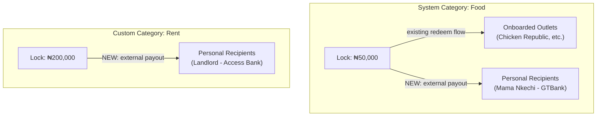
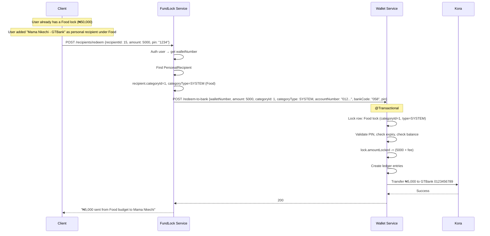
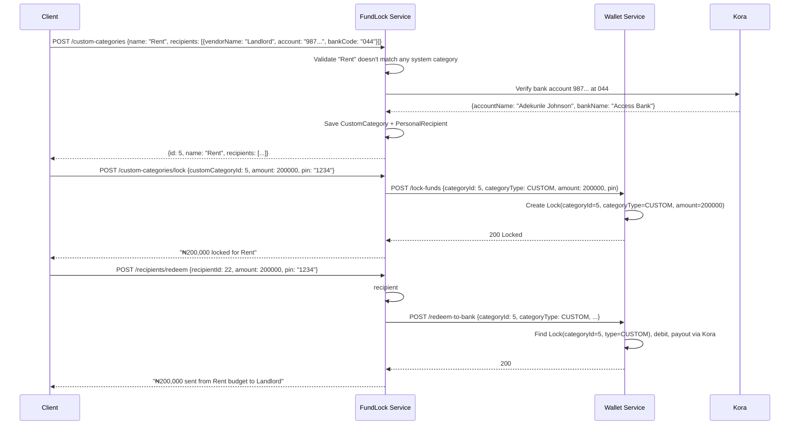

# Personal Recipients & Custom Categories

## The "Two Food Locks" Problem (Solved)

The original plan had a flaw: if "Food" exists as a system category but a user wants to buy from an un-onboarded food vendor, they'd create a custom "Food" category — resulting in **two separate Food locks** with split budgets. That defeats the whole point of budgeting.

**Solution:** Split the feature into two orthogonal concepts:

| Concept | What it solves | Example |
|---|---|---|
| **Personal Recipients** | "I want to spend from my **existing Food lock** at a vendor that isn't onboarded" | User adds "Mama Nkechi - GTBank - 0123456789" as a personal recipient under **Food** |
| **Custom Categories** | "I need to lock funds for a purpose that **doesn't exist** in the system" | User creates a "Rent" category and adds their landlord's bank account |



**One lock per category, two ways to spend.** No duplicate locks.

> [!IMPORTANT]
> Custom categories **cannot** have the same name as an existing system category. If "Food" exists in the system, the user cannot create a custom "Food" — they just add personal recipients to the existing Food category instead.

---

## Proposed Changes

### Overview of What Changes Where

| Layer | Change | Scope |
|---|---|---|
| **FundLock Entities** | New `PersonalRecipient`, `CustomCategory` entities | 2 new tables |
| **FundLock Service** | New `PersonalRecipientService`, `CustomCategoryService` | 2 new services |
| **FundLock Controller** | New `PersonalRecipientController`, `CustomCategoryController` | 2 new controllers |
| **FundLock WalletClient** | New method `redeemToBank()` | 1 new method |
| **FundLock FundLockServiceImpl** | Modify `getAllLocks()` to include custom category locks | Minor edit |
| **Wallet Entity** | Add `categoryType` column to `Lock` | 1 new column |
| **Wallet Enum** | New `CategoryType` enum | 1 new file |
| **Wallet DTOs** | Add `categoryType` to `LockDTO`, `RedeemDTO`, `LockDisplayDTO`, `CacheTransactionDTO` | 4 field additions |
| **Wallet Repository** | Update `findActiveLockForUpdate` query | 1 query change |
| **Wallet Service** | Update `LockingServiceImpl`, new `redeemToBank` method | Moderate edit |
| **Wallet Controller** | New `/redeem-to-bank` endpoint | 1 new endpoint |

---

### FundLock Service — New Entities

#### [NEW] [PersonalRecipient.java](file:///home/samuel/Documents/LockedFunds/services/fundlock/src/main/java/com/lockedfunds/fundlock/entity/PersonalRecipient.java)

A bank account that a user trusts for a specific category. Can be attached to **any** category (system or custom).

```java
@Entity
@Builder
@Data
@AllArgsConstructor
@NoArgsConstructor
public class PersonalRecipient {
    @Id
    @GeneratedValue(strategy = GenerationType.IDENTITY)
    private Long id;

    @ManyToOne(fetch = FetchType.LAZY)
    @JoinColumn(name = "user_id", nullable = false)
    private Users user;

    private Long categoryId;            // Category.id OR CustomCategory.id

    @Enumerated(EnumType.STRING)
    private CategoryType categoryType;  // SYSTEM or CUSTOM

    private String vendorName;          // user-given label: "Mama Nkechi's Shop"
    private String accountNumber;       // bank account number
    private String bankCode;            // e.g., "058" for GTBank
    private String bankName;            // resolved: "Guaranty Trust Bank"
    private String accountName;         // resolved: "Nkechi Okafor"

    private LocalDateTime createdAt;
}
```

#### [NEW] [CustomCategory.java](file:///home/samuel/Documents/LockedFunds/services/fundlock/src/main/java/com/lockedfunds/fundlock/entity/CustomCategory.java)

A user-created category for spending purposes not covered by system categories.

```java
@Entity
@Builder
@Data
@AllArgsConstructor
@NoArgsConstructor
public class CustomCategory {
    @Id
    @GeneratedValue(strategy = GenerationType.IDENTITY)
    private Long id;

    @ManyToOne(fetch = FetchType.LAZY)
    @JoinColumn(name = "user_id", nullable = false)
    private Users user;

    @Column(nullable = false)
    private String name;  // e.g., "Rent", "School Fees"

    private LocalDateTime createdAt;
}
```

#### [NEW] [CategoryType.java](file:///home/samuel/Documents/LockedFunds/services/fundlock/src/main/java/com/lockedfunds/fundlock/enums/CategoryType.java)

```java
public enum CategoryType {
    SYSTEM,  // admin-defined categories (Food, Transport, etc.)
    CUSTOM   // user-created categories
}
```

---

### FundLock Service — New Repositories

#### [NEW] PersonalRecipientRepository.java

```java
public interface PersonalRecipientRepository extends JpaRepository<PersonalRecipient, Long> {
    List<PersonalRecipient> findAllByUserAndCategoryIdAndCategoryType(
        Users user, Long categoryId, CategoryType categoryType
    );

    Optional<PersonalRecipient> findByIdAndUser(Long id, Users user);

    boolean existsByUserAndCategoryIdAndCategoryTypeAndAccountNumber(
        Users user, Long categoryId, CategoryType categoryType, String accountNumber
    );
}
```

#### [NEW] CustomCategoryRepository.java

```java
public interface CustomCategoryRepository extends JpaRepository<CustomCategory, Long> {
    List<CustomCategory> findAllByUser(Users user);
    Optional<CustomCategory> findByIdAndUser(Long id, Users user);
    boolean existsByNameIgnoreCaseAndUser(String name, Users user);
}
```

---

### FundLock Service — New DTOs

```java
// --- Personal Recipient DTOs ---

public class AddPersonalRecipientDTO {
    private Long categoryId;
    private CategoryType categoryType;  // SYSTEM or CUSTOM
    private String vendorName;          // "Mama Nkechi's Shop"
    private String accountNumber;       // "0123456789"
    private String bankCode;            // "058"
}

public class PersonalRecipientResponseDTO {
    private Long id;
    private Long categoryId;
    private CategoryType categoryType;
    private String vendorName;
    private String accountNumber;
    private String bankCode;
    private String bankName;
    private String accountName;
}

public class RedeemToRecipientRequestDTO {
    private Long recipientId;     // PersonalRecipient.id
    private BigDecimal amount;
    private String pin;
}

// --- Custom Category DTOs ---

public class CreateCustomCategoryDTO {
    private String name;
    private List<AddPersonalRecipientDTO> recipients;  // optional initial recipients
}

public class CustomCategoryResponseDTO {
    private Long id;
    private String name;
    private List<PersonalRecipientResponseDTO> recipients;
    private LocalDateTime createdAt;
}

public class LockCustomFundsDTO {
    private Long customCategoryId;
    private BigDecimal amountLocked;
    private String pin;
    private LocalDate expiresAt;
}
```

---

### FundLock Service — New Services

#### [NEW] PersonalRecipientService / PersonalRecipientServiceImpl

```java
public interface PersonalRecipientService {

    // Add a bank account recipient to a system or custom category
    DataResponseDTO addRecipient(AddPersonalRecipientDTO dto);

    // List recipients for a category
    DataResponseDTO getRecipients(Long categoryId, CategoryType categoryType);

    // Remove a recipient
    DataResponseDTO removeRecipient(Long recipientId);

    // Redeem locked funds to a personal recipient's bank account
    DataResponseDTO redeemToRecipient(RedeemToRecipientRequestDTO dto);
}
```

**Key logic for `addRecipient()`:**
1. Authenticate user
2. If `categoryType == SYSTEM` → validate `categoryId` exists in `Category` table
3. If `categoryType == CUSTOM` → validate `categoryId` exists in `CustomCategory` table AND user owns it
4. Verify bank account via Kora's bank verification API (reuse `koraClient.verifyBankAccount()`)
5. Check no duplicate (same user + category + account number)
6. Save `PersonalRecipient` with resolved `bankName` and `accountName`

**Key logic for `redeemToRecipient()`:**
1. Authenticate user, get `walletNumber`
2. Find `PersonalRecipient` by ID, verify the user owns it
3. Determine the categoryId and categoryType from the recipient
4. Build a `RedeemToBankDTO` with the bank details + lock info
5. Call `walletClient.redeemToBank(dto, authHeader)`
6. On success, send push notification

#### [NEW] CustomCategoryService / CustomCategoryServiceImpl

```java
public interface CustomCategoryService {
    DataResponseDTO createCustomCategory(CreateCustomCategoryDTO dto);
    DataResponseDTO getMyCustomCategories();
    DataResponseDTO deleteCustomCategory(Long customCategoryId);
    DataResponseDTO lockCustomFunds(LockCustomFundsDTO dto);
}
```

**Key logic for `createCustomCategory()`:**
1. Authenticate user
2. Validate name doesn't match any system category (`categoryRepository.existsByNameIgnoreCase`)
3. Validate name doesn't match user's existing custom categories
4. Save `CustomCategory`
5. If initial recipients provided, verify each bank account and save as `PersonalRecipient` with `categoryType=CUSTOM`

**Key logic for `lockCustomFunds()`:**
1. Authenticate user, get `walletNumber`
2. Validate user owns the custom category
3. Build `LockDTO` with `category_id = customCategory.getId()` and `categoryType = CUSTOM`
4. Call `walletClient.lockFunds(dto, authHeader)` — same endpoint, just with the extra field

---

### FundLock Service — New Controllers

#### [NEW] PersonalRecipientController

```
POST   /api/v1/fundlock/recipients                → addRecipient
GET    /api/v1/fundlock/recipients?categoryId=X&categoryType=SYSTEM  → getRecipients
DELETE /api/v1/fundlock/recipients/{id}            → removeRecipient
POST   /api/v1/fundlock/recipients/redeem          → redeemToRecipient
```

#### [NEW] CustomCategoryController

```
POST   /api/v1/fundlock/custom-categories          → createCustomCategory
GET    /api/v1/fundlock/custom-categories           → getMyCustomCategories
DELETE /api/v1/fundlock/custom-categories/{id}      → deleteCustomCategory
POST   /api/v1/fundlock/custom-categories/lock      → lockCustomFunds
```

> [!NOTE]
> Redeeming from a custom category lock uses the **same** `POST /recipients/redeem` endpoint. The recipient already knows which category it belongs to, so it works for both system and custom categories.

---

### FundLock Service — Modifications

#### [MODIFY] [WalletClient.java](file:///home/samuel/Documents/LockedFunds/services/fundlock/src/main/java/com/lockedfunds/fundlock/walletService/WalletClient.java)

Add new method:
```java
public DataResponseDTO redeemToBank(RedeemToBankDTO dto, String authorization) {
    // POST to http://wallet-service/api/v1/wallets/redeem-to-bank
    // Same error-handling pattern as existing methods
}
```

Existing `lockFunds()` — no signature change needed, just the `LockDTO` payload now carries `categoryType`.

#### [MODIFY] [FundLockServiceImpl.java](file:///home/samuel/Documents/LockedFunds/services/fundlock/src/main/java/com/lockedfunds/fundlock/service/impl/FundLockServiceImpl.java)

- `lockFunds()` (line ~295): Add `lockDTO.setCategoryType(CategoryType.SYSTEM)` before calling `walletClient.lockFunds()`. This makes existing system locks explicitly typed.
- `redeemFunds()` (line ~147): Add `categoryType = SYSTEM` to the `RedeemDTO`.
- `redeemFundsByOrgId()` (line ~780): Add `categoryType = SYSTEM` to the `RedeemDTO`.
- `getAllLocks()` (line ~610): Also fetch custom category locks and resolve names from `CustomCategory` instead of `Category`.

---

### Wallet Service — Changes

#### [NEW] [CategoryType.java](file:///home/samuel/Documents/LockedFunds/services/wallet/src/main/java/com/lockedfunds/wallet/enums/CategoryType.java)

```java
public enum CategoryType {
    SYSTEM,
    CUSTOM
}
```

#### [MODIFY] [Lock.java](file:///home/samuel/Documents/LockedFunds/services/wallet/src/main/java/com/lockedfunds/wallet/entity/Lock.java)

```diff
+ import com.lockedfunds.wallet.enums.CategoryType;

  private Long categoryId;

+ @Enumerated(EnumType.STRING)
+ @Column(nullable = false)
+ private CategoryType categoryType = CategoryType.SYSTEM;
```

**Database migration:**
```sql
ALTER TABLE lock ADD COLUMN category_type VARCHAR(10) NOT NULL DEFAULT 'SYSTEM';
```

All existing locks automatically get `SYSTEM` — fully backward compatible.

#### [MODIFY] [LockDTO.java](file:///home/samuel/Documents/LockedFunds/services/wallet/src/main/java/com/lockedfunds/wallet/dto/LockDTO.java)

```diff
+ private CategoryType categoryType;  // null treated as SYSTEM for backward compat
```

#### [MODIFY] [RedeemDTO.java](file:///home/samuel/Documents/LockedFunds/services/wallet/src/main/java/com/lockedfunds/wallet/dto/RedeemDTO.java)

```diff
+ private CategoryType categoryType;
```

#### [MODIFY] [LockDisplayDTO.java](file:///home/samuel/Documents/LockedFunds/services/wallet/src/main/java/com/lockedfunds/wallet/dto/LockDisplayDTO.java)

```diff
+ private CategoryType categoryType;
```

#### [MODIFY] [CacheTransactionDTO.java](file:///home/samuel/Documents/LockedFunds/services/wallet/src/main/java/com/lockedfunds/wallet/dto/CacheTransactionDTO.java)

```diff
+ private CategoryType categoryType;
```

#### [NEW] RedeemToBankDTO.java

DTO for the new external payout endpoint:
```java
public class RedeemToBankDTO {
    private String userWalletNumber;
    private BigDecimal amount;
    private Long categoryId;
    private CategoryType categoryType;
    private String accountNumber;     // recipient's bank account
    private String bankCode;
    private String email;             // for Kora payout
    private String recipientName;     // for Kora payout
    private String pin;
}
```

#### [MODIFY] [LockRepository.java](file:///home/samuel/Documents/LockedFunds/services/wallet/src/main/java/com/lockedfunds/wallet/repositories/LockRepository.java)

Update the query to include `categoryType`:

```diff
  @Lock(LockModeType.PESSIMISTIC_WRITE)
  @Query("""
      SELECT l FROM Lock l
      WHERE l.wallet.walletNumber = :walletNumber
      AND l.categoryId = :categoryId
+     AND l.categoryType = :categoryType
      AND l.status = :status
      """)
  Optional<Lock> findActiveLockForUpdate(
          String walletNumber,
          Long categoryId,
+         CategoryType categoryType,
          LockedFundStatus status
  );
```

#### [MODIFY] [LockingServiceImpl.java](file:///home/samuel/Documents/LockedFunds/services/wallet/src/main/java/com/lockedfunds/wallet/services/impl/LockingServiceImpl.java)

1. **`lockFundsPerCategory()`** — default `categoryType` to `SYSTEM` if null (backward compat), pass it to `findActiveLockForUpdate()` and set on new Lock entities.

2. **`redeemFundsPerCategory()`** — default `categoryType` to `SYSTEM` if null, pass it to `findActiveLockForUpdate()`.

3. **New method `redeemToBank()`:**

```java
@Transactional(isolation = Isolation.READ_COMMITTED, rollbackFor = Exception.class)
public DataResponseDTO redeemToBank(RedeemToBankDTO dto) {
    CategoryType catType = dto.getCategoryType() != null
        ? dto.getCategoryType() : CategoryType.SYSTEM;

    // 1. Find and lock the Lock row
    Lock lock = lockRepository.findActiveLockForUpdate(
        dto.getUserWalletNumber(), dto.getCategoryId(),
        catType, LockedFundStatus.ACTIVE
    ).orElseThrow(() -> new NoLockFoundException("No active lock found"));

    // 2. Find and lock the system wallet
    Wallet systemWallet = walletRepository.findByWalletNumberForUpdate("0")
        .orElseThrow(() -> new WalletNotFoundException("System Wallet not found"));

    // 3. Validate PIN
    if (!bCryptPasswordEncoder.matches(dto.getPin(), lock.getWallet().getPin()))
        throw new InvalidPinException("Invalid PIN.");

    // 4. Check expiry
    if (lock.getExpiresAt().isBefore(LocalDate.now())) {
        lock.setStatus(LockedFundStatus.EXPIRED);
        lockRepository.save(lock);
        throw new LockExpiredException("Lock expired");
    }

    // 5. Calculate fee, check balance
    BigDecimal fee = feeService.calculateFee(TransactionType.TRANSFER, dto.getAmount());
    BigDecimal totalDebit = dto.getAmount().add(fee);
    if (lock.getAmountLocked().compareTo(totalDebit) < 0)
        throw new InsufficientFundsException("Insufficient locked funds");

    // 6. Debit the lock
    lock.setAmountLocked(lock.getAmountLocked().subtract(totalDebit));
    lock.setAmountRedeemed(lock.getAmountRedeemed().add(totalDebit));

    // 7. Create transaction + ledger entries (debit lock owner, credit system for fee)
    // ... same pattern as redeemFundsPerCategory but without crediting an outlet wallet

    // 8. Payout via Kora (reuse pattern from WalletServiceImpl.withdraw())
    // Build TransferRequestDTO → koraClient.transferToBank()

    // 9. Update lock status if depleted
    if (lock.getAmountLocked().compareTo(BigDecimal.ZERO) == 0) {
        lock.setStatus(LockedFundStatus.EXPIRED);
    }
    lockRepository.save(lock);

    // 10. Publish Kafka event
    // ...

    return DataResponseDTO.builder()
        .status("200")
        .message("Funds sent to bank account successfully")
        .build();
}
```

#### [MODIFY] [LockingService.java](file:///home/samuel/Documents/LockedFunds/services/wallet/src/main/java/com/lockedfunds/wallet/services/LockingService.java)

```diff
+ DataResponseDTO redeemToBank(RedeemToBankDTO dto);
```

#### [MODIFY] [WalletController.java](file:///home/samuel/Documents/LockedFunds/services/wallet/src/main/java/com/lockedfunds/wallet/controllers/WalletController.java)

```java
@PostMapping("/redeem-to-bank")
public ResponseEntity<DataResponseDTO> redeemToBank(@RequestBody RedeemToBankDTO dto) {
    return new ResponseEntity<>(lockingService.redeemToBank(dto), HttpStatus.OK);
}
```

---

### Flow Diagrams

#### Spending from a System Category at an Un-onboarded Vendor



#### Creating and Using a Custom Category



---

### Why This Design Works

| Concern | How it's handled |
|---|---|
| **Two Food locks?** | Impossible — personal recipients attach to the existing system Food category. Same lock, two spending paths. |
| **Wallet complexity?** | Minimal — Wallet gains one column (`categoryType`) and one new endpoint. It doesn't know about personal recipients, custom categories, or vendor names. |
| **Backward compatibility?** | All existing locks default to `categoryType=SYSTEM`. Existing endpoints continue to work. |
| **ID collisions?** | `categoryType` discriminator prevents system `Category.id=1` (Food) from conflicting with `CustomCategory.id=1` (Rent). |
| **Category gating?** | For system categories: onboarded outlets (existing) + personal recipients (new). For custom categories: personal recipients only. |
| **External payout?** | Reuses existing Kora `transferToBank()` infrastructure from `WalletServiceImpl.withdraw()`. |
| **Expiry/refund?** | Custom category locks expire the same way via the Quartz job — no changes needed since it doesn't filter by `categoryType`. |

---

## Verification Plan

### Automated Tests
1. **PersonalRecipientServiceImpl** — add/remove recipients, bank verification, duplicate prevention, ownership validation
2. **CustomCategoryServiceImpl** — create/delete, prevent system category name duplication
3. **LockingServiceImpl** — verify `categoryType` passes through lock/redeem correctly, backward compat (null → SYSTEM)
4. **RedeemToBank** — full flow: lock → redeem-to-bank → verify lock debited, Kora called
5. **Existing flows** — run existing lock/redeem tests to verify nothing broke

### Manual Verification
1. End-to-end Postman test: add personal recipient to Food → lock Food → redeem to recipient
2. End-to-end Postman test: create custom category → add recipient → lock → redeem
3. Verify `getAllLocks` returns both system and custom locks with correct names
4. Verify Quartz `ExpiredFundLockJob` refunds custom category locks
5. Verify Kora payout in sandbox environment
